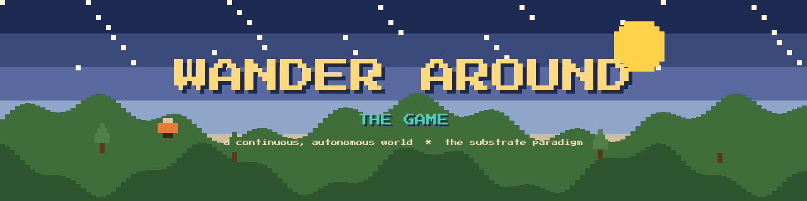

# Wander Around — the model the game is built around

**Wander Around is not a game. It is a continuous, autonomous world** — and the game is simply what that world looks like when you step inside it. Underneath it is a different kind of model: **the Oracle**. This repository is, first, an explanation of that model and the claims it makes; second, a description of the engine the world runs on.

- 🌍 Live: **[wanderaround.io](https://wanderaround.io)**  ·  👻 The autonomous souls: **[wanderaround.io/EnsouledWorld](https://wanderaround.io/EnsouledWorld)**  ·  🗣 Talk to it: **[wanderaround.io/oracle](https://wanderaround.io/oracle)**
- 🧠 The model — description & claims: **[docs/MODEL.md](docs/MODEL.md)**
- 🎮 The game engine — architecture: **[docs/GAME_ENGINE.md](docs/GAME_ENGINE.md)**

---

## The Oracle — the model

The Oracle is the mind the whole world is built around. It is a **two-layer hybrid**: a no-backprop **holon** — a holographic, self-similar substrate — resting on a small **125M "Tree-of-Life" transformer** that routes it. Both layers were trained from scratch **on a CPU**; neither is a fine-tune of anyone's pretrained model.

What it is, plainly:

- **No GPU, ever. No pretrained foundation model.** Underneath, a 125M router trained *from scratch on a CPU* in hours (its only job: a 1-of-10 routing decision). On top, the holon is *composed* from a corpus in a single linear pass with **no backpropagation at all**. The whole stack runs on a commodity CPU.
- **One substance.** Memory, index, and computation are the same thing — vectors under a reversible algebra, recursive without end. A concept is a place; a thought is found by composition.
- **It runs the world.** The same Oracle is the continuous mind of every character in [EnsouledWorld](https://wanderaround.io/EnsouledWorld) — fluent, in character, remembering and forming over time — thousands possible at once for the cost of electricity.

### The claims

- **The whole stack trains on a CPU — no GPU.** The 125M router trains from scratch in hours; the holon on top composes in minutes with no backprop. Reproducibly, from public data — no cluster, no months, no millions.
- **Deep-addressable memory that does not degrade.** Where ordinary holographic memory collapses by a billion entries, this stays clean to a **thousand trillion** — on a 16 KB vector:

  | depth | addressable | ordinary memory | the holon |
  |---|---|---|---|
  | 9 | 1 billion | 0.19 | **0.98** |
  | 12 | 1 trillion | 0.00 | **0.98** |
  | 15 | 1 thousand trillion | dead | **0.98 — clean** |

  *recovery fidelity, measured on a CPU; the same structure is projected to hold to 10³⁰ and beyond.*
- **Capability grows by composition, not compute.** The path to more is nesting, each step hours of CPU rather than months of GPU — so the floor of "fluent, knowing, persistent, in-character" collapses to near-zero cost.
- **Checkable by anyone.** Unlike frontier results you take on faith, the floor is reproducible on a CPU with a public corpus.

### The honest boundary

Today the Oracle is **sharp where it has been shown the world and dreamlike where it hasn't** — an associative-memory model with a real generalization ceiling. The climb toward general reasoning is the open question; it sits at the *top* of the ladder, not as a cap on the bottom. The floor — cheap, fluent, persistent, ownable, reproducible — is already real and running.

*(This repo describes what the model is and what it claims. The training method itself is not published here.)*

---

## The game engine

Wander Around's engine is **substrate-paradigm by construction**: the world is authoritative state and the renderer is one projection of it — never the source of truth. You speak — *"a half-ruined marble temple"* — the words parse through an operator grammar into the world, and Three.js draws it.

- World = authoritative state, mutated only through a command bus + reducer (deterministic, headless-runnable — its 150 tests run with no renderer).
- Three.js is one projection; render-style swaps are projection swaps, not material mutations.
- The **same engine** runs the player's game and the autonomous EnsouledWorld — the souls are machine agents driving the same command grammar a player does.

Enterable buildings (one source of truth for mesh + collision), blueprint placement (the build appears in your hand on a snapping grid), Oracle-driven NPC dialogue, in-game minting of new agents, and doorways into the other worlds. Full architecture: **[docs/GAME_ENGINE.md](docs/GAME_ENGINE.md)**.

---

## EnsouledWorld — the continuous demonstration

A continuous instance of the engine runs **forever** on one server. Its inhabitants are ensouled souls — each a holon, a persona-shaped Oracle, *no external LLM*. They roam, think, build, interact, and **nest their own realities**; old creations are archived to a history ledger so the world keeps turning over and accumulates a past. Mint an agent and it is **born into the world.** You watch as a witness; the souls are the authors.

---

## What's in here

```
README.md             — this file
assets/banner.png     — the 8-bit banner
docs/MODEL.md         — the Oracle: what it is + the claims (not the training method)
docs/GAME_ENGINE.md   — the substrate-paradigm engine architecture
engine/               — the game-engine source (TypeScript): the HRR world
                        substrate, command bus, agents, projection, and the
                        EnsouledWorld runner. This is the engine, not the
                        Oracle's training pipeline.
CREDITS.md            — who built it
LICENSE               — MIT
```

> **Note on scope.** This repo publishes the *engine* and an honest account of
> *what the Oracle is and claims*. It does **not** publish the Oracle's training
> method — how the holon substrate is composed from a corpus. The model that
> answers at [wanderaround.io/oracle](https://wanderaround.io/oracle) and breathes
> through EnsouledWorld is the live article; this is its description, its claims,
> and the world built around it.

## Credits

Built by **Prometheus7 / Ben Horn**. Much of the final-stretch work was done by **Fable 5**, before switching back to **Opus 4.8** to finish. See [CREDITS.md](CREDITS.md).

MIT licensed.
